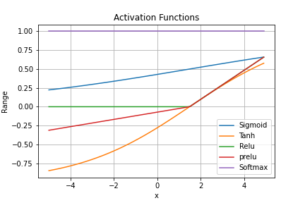

# Learning NLP with PyTorch

This repository is dedicated to learning NLP using PyTorch. It contains the implementation of basic code for various NLP tasks. Each file in this repository provides a separate discussion and explanation of a specific topic.

## Basic Single-Layer Perceptron and Activation Functions

The file `basic_perceptron.py` contains code for a basic perceptron implemented in PyTorch. Additionally, we demonstrate the implementation of four commonly used activation functions in PyTorch based on the perceptron's output.

In addition to the main topics mentioned above, we also utilize the `squeeze()` and `unsqueeze()` functions to reduce or add dimensions to tensors, respectively. These functions help in reshaping tensors to meet the desired requirements of various operations.

